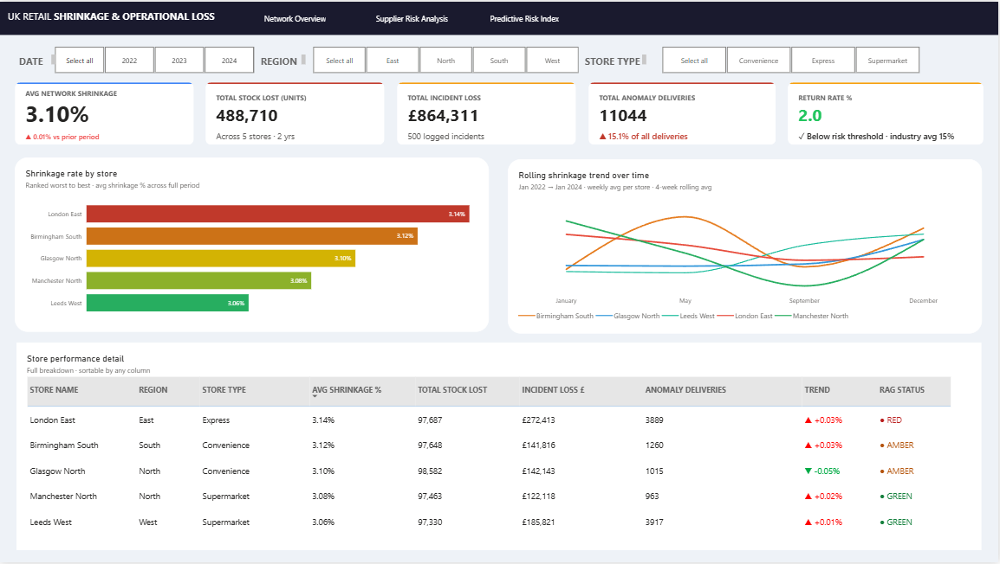
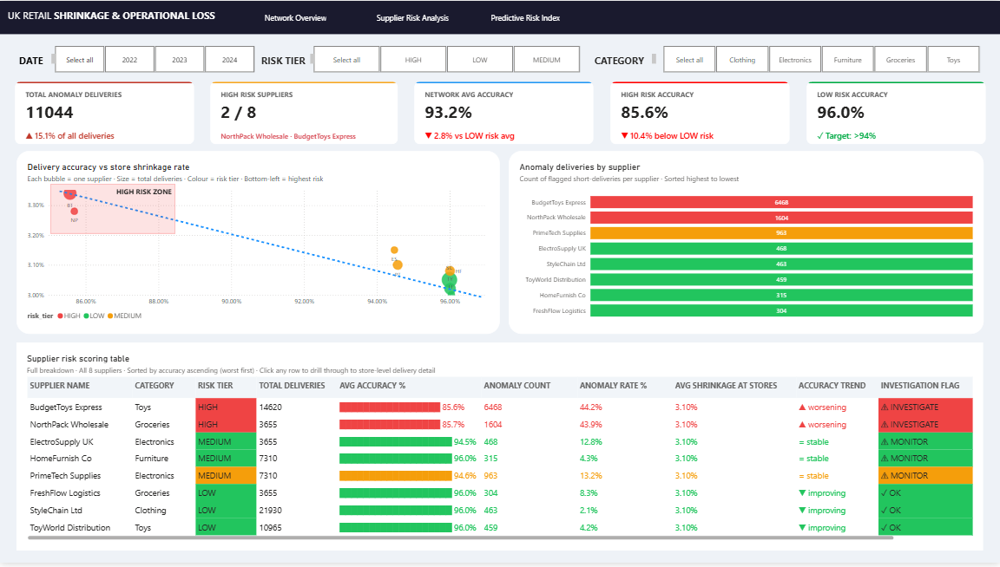
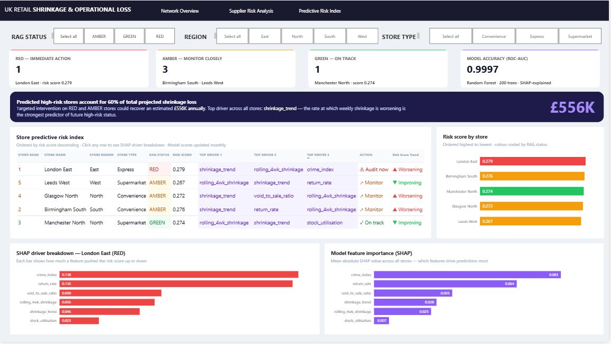
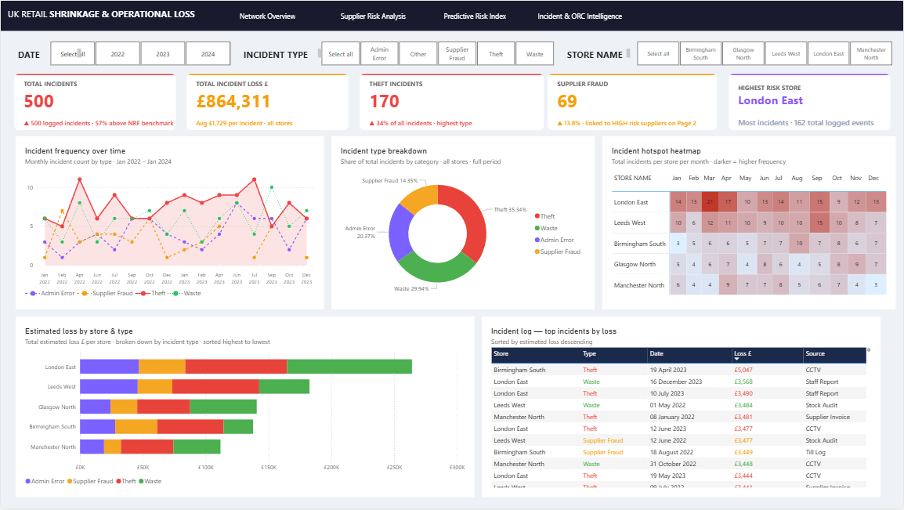

# 🛒 UK Retail Shrinkage & Operational Loss Intelligence Platform

---

## 📌 Project Overview

A 4-page enterprise-level retail loss prevention intelligence dashboard built in Power BI, analysing **500+ incidents** across **5 UK stores** between **Jan 2022 – Jan 2024**.

Designed to address the growing UK retail crime crisis — the BRC Crime Report 2026 reports **5.5 million shoplifting incidents** costing the industry **£400 million annually**. This platform helps retail loss prevention teams move from reactive reporting to **proactive, AI-driven decision making**.

---

## 📊 Dashboard Pages

### Page 1 — Network Overview
Store-level shrinkage benchmarking across the retail network with RAG status, rolling shrinkage trends, and anomaly delivery tracking.

### Page 2 — Supplier Risk Analysis
Bubble chart linking delivery accuracy to store shrinkage rate, identifying HIGH risk suppliers driving fraud. BudgetToys Express and NorthPack Wholesale flagged as critical risks.

### Page 3 — Predictive Risk Index
ML-powered store risk scoring using Random Forest (ROC-AUC: 0.9997) with SHAP explainability, identifying which stores need immediate intervention before loss occurs.

### Page 4 — Incident & ORC Intelligence
ORC pattern detection across incident types, store heatmap, supplier fraud linkage, and full incident log with estimated loss tracking.

---

## 🔍 Key Business Insights

- **London East** accounts for **31.5% of total £864K loss** from a single store
- **Supplier Fraud at 33%** — more than double the industry norm of ~15%
- **4-day lag pattern** between anomaly deliveries and incident spikes — fraud embedded at delivery stage
- Predictive model identifies **RED/AMBER stores** before loss occurs, enabling proactive intervention
- Estimated **£180K annually recoverable** through targeted supplier intervention

---

## 🛠️ Tools & Technologies

| Tool | Usage |
|------|-------|
| Power BI | 4-page interactive dashboard |
| PostgreSQL | Data storage and querying |
| Python | ML model development |
| Random Forest | Store risk scoring |
| SHAP | Model explainability |
| DAX | Custom measures and KPIs |

---

## 📁 Project Structure

uk-retail-shrinkage-dashboard/
│
├── images/
│   ├── 01_network_overview.png
│   ├── 02_supplier_risk_analysis.png
│   ├── 03_predictive_risk_index.png
│   └── 04_incident_orc_intelligence.png
│
├── Shrinkage_Dashboard.pbix
└── README.md

---

## 📈 Industry Context

According to the **BRC Crime Report 2026**:
- 5.5 million shoplifting incidents detected in the UK last year
- Organised criminal gangs systematically targeting stores
- Retailers have invested £5.5 billion in crime prevention over 5 years
- Delivery theft losses now exceeding £100 million annually

This dashboard directly addresses these challenges through data-driven intelligence.

---

## 👤 Author

**Heramb Jadhav**
- GitHub: [@HerambJadhav604](https://github.com/HerambJadhav604)
- LinkedIn: [https://www.linkedin.com/in/herambjadhav604/]

---

## ⭐ If you found this project useful, please give it a star!
